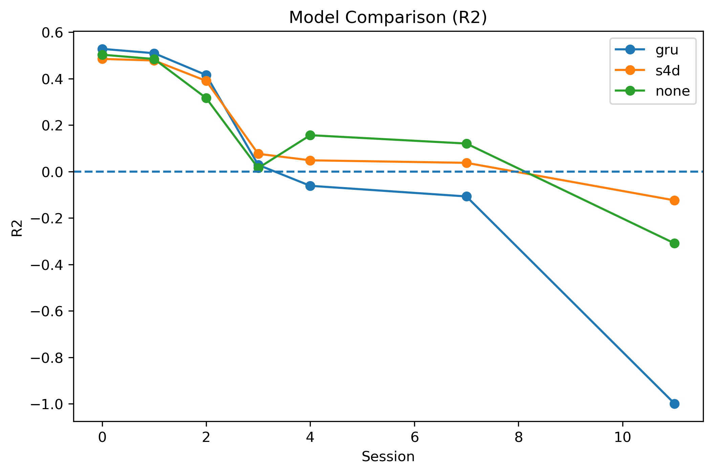

事先声明: 

- 该代码库源自 [Generalizable, real-time neural decoding with hybrid state-space models](https://arxiv.org/pdf/2506.05320), 并且由 [freesky3](https://github.com/freesky3/my_POSSM) 首次实现, 该 fork 库进行了个人的改动. 
- 本代码在 Linux 系统上运行. 对于 Windows 系统, 可启用 [WSL2](https://learn.microsoft.com/zh-cn/windows/wsl/install). 

# 1. 下载代码库

```bash
git clone https://github.com/Muatyz/rePOSSM.git
cd rePOSSM
```

# 2. 更新 conda

```bash
conda update -n base -c defaults conda
```

# 3. 创建环境

```bash
conda env create -f environment.yml
```

# 4. 激活环境

```bash
conda activate possm
```

# 5. 下载数据

数据来源：[NLB_maze](https://neurallatents.github.io/datasets.html)

数据格式：[Notebook](https://github.com/neurallatents/neurallatents.github.io/blob/master/notebooks/mc_maze.ipynb)

```
dandi download DANDI:000128/0.220113.0400
```

---

长期数据的下载网页：[Using adversarial networks to extend brain computer interface decoding accuracy over time](https://zenodo.org/records/8271239)

示例代码使用的是 `Chewie_CO_2016.7z` 数据集. 

数据位于 `data/dataset/` 目录下

# 6. 训练模型

在根目录下, 执行 

```bash
python main.py --train --model possm --backbone gru
```

通过 `--train` 参数指定训练, `--model` 参数指定模型, `--backbone` 参数指定骨干网络(`gru` 或者 `s4d`).

也可通过以下指令完成 baseline 模型的训练: 

```bash
python main.py --train --model rnn --backbone rnn
```

训练后的模型权重将以 `.pt` 保存在 `checkpoints/` 目录下.

# 7. 评估模型

在根目录下, 执行 

```bash
python main.py --eval --model possm --backbone gru --ckpt 059b9e
```

通过 `--eval` 参数指定评估, `--model` 参数指定模型, `--backbone` 参数指定骨干网络(`gru` 或者 `s4d`), `--ckpt` 参数指定要加载的模型六位码. 

评估结果将以 `.json` 保存在 `results/` 目录下.

# 8. 可视化结果

在根目录下, 执行 

```bash
python scripts/plot_compare.py
```

将自动读取 `results/` 目录下的评估结果, 并生成 $R^{2}$ 比较图. 



# Todo

- [x] RNN baseline 的实现

- [ ] velocity prediction & 实际数据的画图对比

- [ ] Transformer baseline 的实现